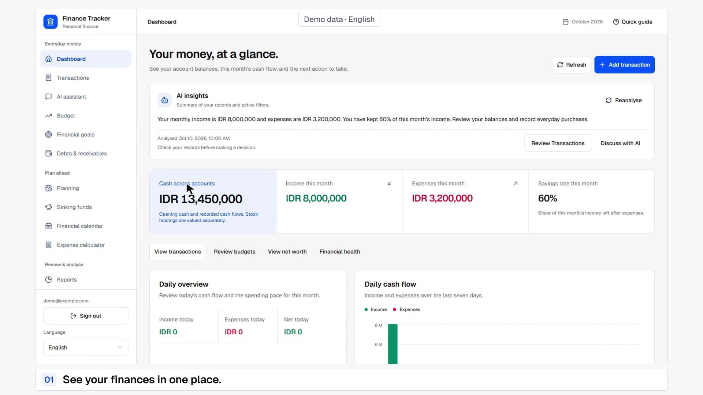
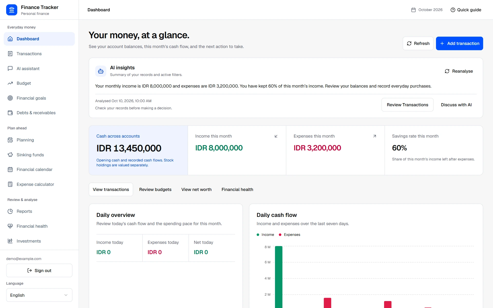
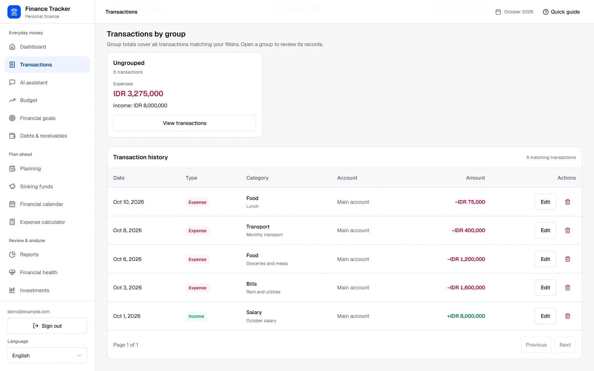
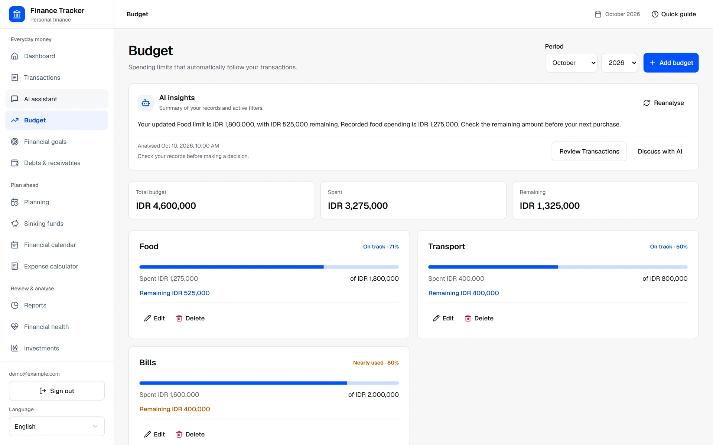
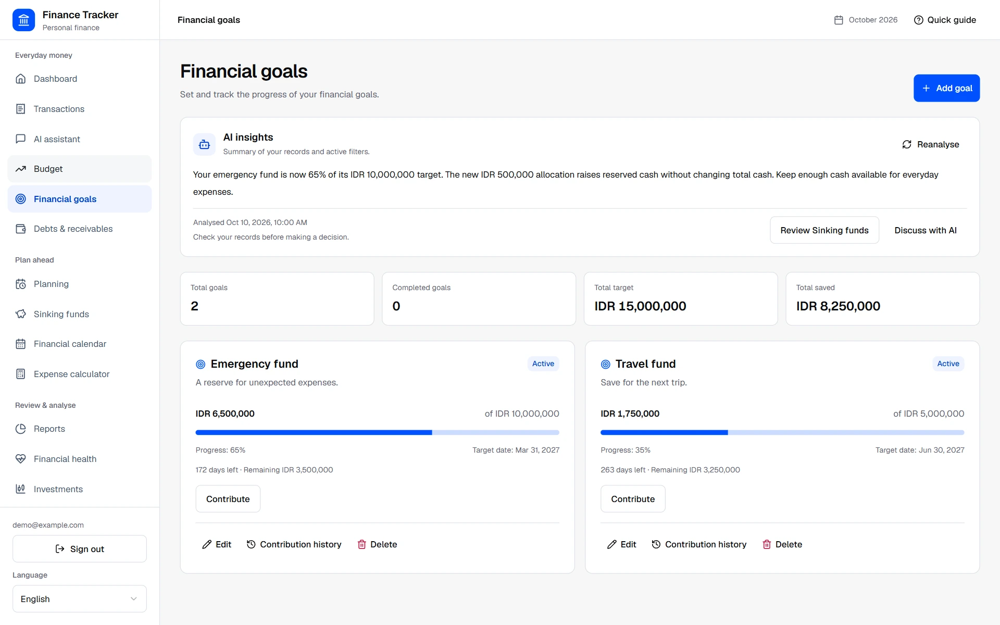
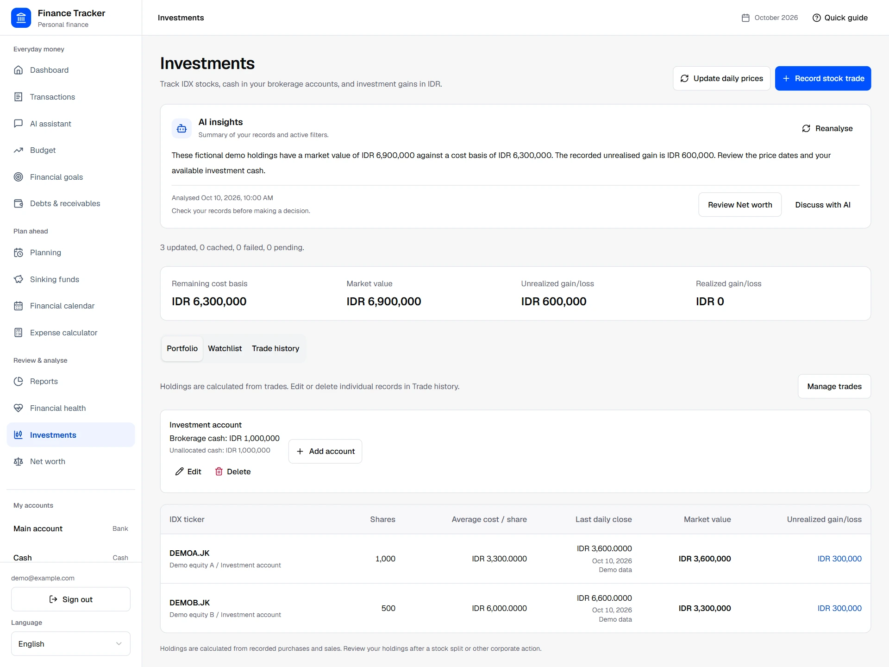
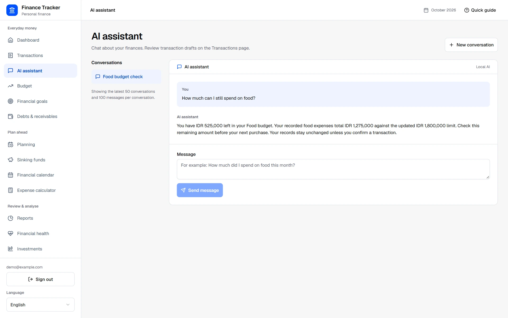
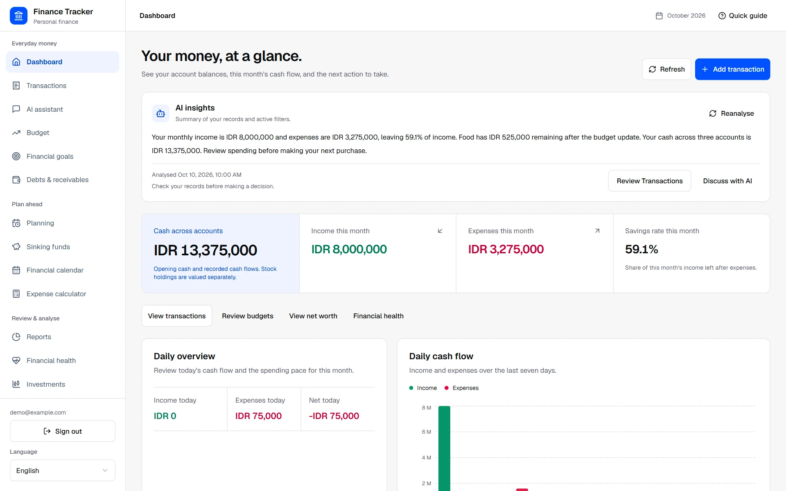
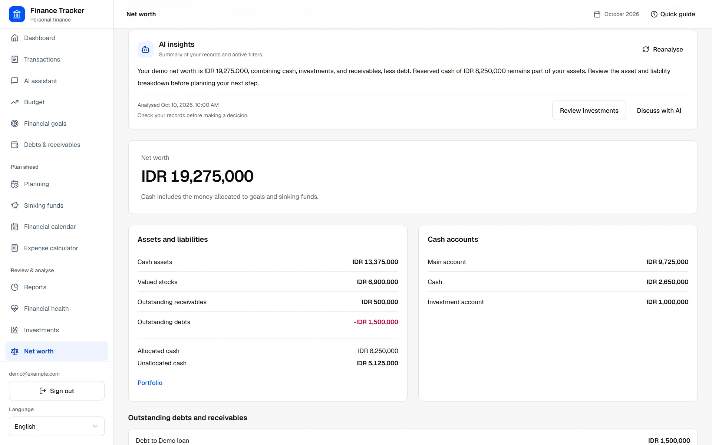

# Finance Tracker

Finance Tracker is a personal-finance web app for recording, understanding, and planning money in Indonesian rupiah (IDR). It connects accounts, everyday transactions, budgets, savings goals, investments, debts, and forecasts to the same financial history. A local AI assistant helps explain the records and prepare transaction drafts for review.

[Demo video](#60-second-demo) · [Product tour](#product-tour) · [Example workflow](#a-connected-example) · [Run locally](#run-locally) · [Architecture](#architecture)

## 60-second demo

[](docs/media/finance-tracker-demo.mp4)

[Watch or download the MP4](docs/media/finance-tracker-demo.mp4?raw=true) (60 seconds, 1080p, English).

Made with Brag using recordings of the original interface. The video follows actual clicks and form entries across Dashboard, Transactions, Budget, Financial goals, Investments, AI assistant, AI insights, and Net worth.

The video and screenshots use fictional demo data, stock symbols, and prices. AI responses are prepared examples. The app supports English and Indonesian, with amounts in IDR.

## The problem

An account balance alone does not show how much is already reserved for a goal, whether spending is close to a budget limit, or how unpaid debt changes net worth. Keeping purchases, savings, stocks, and repayments in separate records also makes it harder to explain why a balance changed.

You can trace cash changes to transactions, review a month's budget use, reserve money for upcoming needs, and combine assets and liabilities in Net worth. Forecasts and AI explanations use those records. Recording a financial change requires an explicit action.

## Who it is for

For individuals managing several bank or cash accounts, saving toward specific goals, holding IDX stocks, or planning around recurring income and bills. The interface works on desktop and mobile, with a built-in Quick guide for the main workflows.

## Product tour

### Dashboard and accounts

Start with cash across accounts, income and expenses for the selected month, and the share of income left after expenses. Daily cash flow, balance history, spending categories, and month-over-month comparisons help explain the figures. Accounts can represent bank balances, cash, or investment-account cash, with editable opening balances and details.

The dashboard links directly to transactions, budgets, financial health, and net worth. A transfer moves cash between accounts while preserving total cash. Stock holdings are valued separately from brokerage cash.



### Transactions

Record income, expenses, or transfers against their accounts. Search the full history, including categories and notes, and filter by type, account, group, and date range. Matching totals cover all filtered records, including records outside the current page. Groups collect transactions for an activity such as a trip while preserving each record's spending category.

Edit or delete eligible records. Read receipt prepares one expense draft from an image's final total. Review its amount, account, date, and category before confirming it on Transactions.



### Monthly budgets

Set a spending limit for each category and review the amount spent, amount remaining, and progress toward the limit. Budget use follows recorded expenses in the selected month. Edit a limit when your plan changes and enable rollover where needed.

In the demo, Food spending is IDR 1,275,000 against an updated IDR 1,800,000 limit, leaving IDR 525,000. The total budget and remaining amount update from the same records.



### Financial goals

Set a target amount and date, then allocate contributions from an account. Each goal shows saved money, progress, remaining amount, and time until its target date. Contribution history keeps the source account and allocation history readable.

The demo Emergency fund reaches IDR 6,500,000 of its IDR 10,000,000 target, or 65%. Contributions reserve existing cash. They do not reduce the account's cash balance until an actual cash transaction is recorded.



### Investments

Track IDX stock purchases and sales, brokerage cash, fees, cost basis, and realized or unrealized gains. Portfolio, Watchlist, and Trade history tabs separate current holdings from instruments you follow and the transactions that created those holdings. Correcting a trade recalculates holdings and cash. Invalid share or cash histories are rejected.

Fractional lots and shares and four-decimal trade prices are supported. Daily closing prices show their date and source. In the demo, holdings worth IDR 6,900,000 have an IDR 6,300,000 cost basis and an IDR 600,000 unrealized gain.



### AI assistant and receipt drafts

Ask questions about recorded balances, spending, budgets, goals, debts, or financial health. The assistant can read permitted financial context and prepare editable transaction drafts. Conversations and pending drafts are saved, so you can return to them after reloading.

Receipt images are stored privately. Unknown amounts, dates, or accounts remain blank for review. An AI draft becomes a financial transaction when you choose Confirm transaction on Transactions.



### Contextual AI insights

Financial pages generate a short explanation when their data is ready. Insights follow the selected month, filters, language, and analysis inputs. Choose Reanalyse for another analysis or Discuss with AI to open its saved conversation.

Page insights use aggregate figures and recognized category labels. Account names, transaction descriptions, counterparties, and stock symbols stay out of the model request. You can keep using the page while analysis is waiting or unavailable.



### Net worth

Combine cash, priced stocks, outstanding receivables, and unpaid debt. The breakdown distinguishes allocated from unallocated cash and keeps account balances visible. Savings allocations remain part of cash assets, preventing goals and sinking funds from being counted twice.

The demo totals IDR 19,275,000 from IDR 13,375,000 cash, IDR 6,900,000 stocks, IDR 500,000 receivables, and IDR 1,500,000 debt. Missing stock prices produce an incomplete total with a labeled known subtotal.



### Planning, repayments, and financial health

| Capability | What you can do |
| --- | --- |
| Debts and receivables | Record partial repayments, inspect payment history, and keep the linked cash transactions consistent with outstanding amounts. |
| Recurring schedules and reconciliation | Plan income, expenses, and transfers with optional end dates, record due entries manually, project payday balances, and reconcile accounts. |
| Financial calendar | Review recurring cash-flow dates, debt deadlines, and sinking-fund targets in one monthly calendar. |
| Sinking funds | Reserve account cash for expected expenses, review allocation/release history, calculate suggested monthly savings, and record a linked expense when the money is spent. |
| Expense calculator | Explore dated planned incomes and expenses alongside recorded cash and recurring cash flow, without posting transactions. |
| Reports | Review monthly cash flow, category distributions, and spending changes using the selected reporting period. |
| Financial health | Review calculated ratios, formulas, transaction behavior, missing inputs, and a heuristic score. Current-month results are provisional; analysis inputs do not change financial records. |

## A connected example

The screenshots follow one connected demo. Opening cash is IDR 13,450,000, with IDR 8,000,000 income and IDR 3,200,000 expenses for the month.

1. Save an IDR 75,000 lunch expense to Main account. Cash becomes IDR 13,375,000 and monthly expenses become IDR 3,275,000.
2. Update the Food limit to IDR 1,800,000. Its recorded IDR 1,275,000 spending leaves IDR 525,000 available in that budget.
3. Allocate IDR 500,000 to Emergency fund. Its progress reaches 65%. Total reserved cash becomes IDR 8,250,000 while total cash stays IDR 13,375,000.
4. Ask the AI assistant about the Food budget and review contextual insights against the updated records.
5. Review net worth. Cash plus IDR 6,900,000 stocks and IDR 500,000 receivables, less IDR 1,500,000 debt, totals IDR 19,275,000.

## What connects the product

Financial views share the same records. Transactions feed balances, budgets, and reports. Stock trades feed holdings and brokerage cash, and repayments update outstanding debt and their linked cash entries. Goals and sinking funds reserve cash, and forecasts show proposed changes without recording them.

Authentication uses Supabase email/password signup, email confirmation, cookie sessions, and sign in/out. Financial APIs verify the user, and PostgreSQL ownership policies restrict each user's records. Guided forms, visible loading/error feedback, protected histories, and explicit delete confirmations make the consequence of an action clear.

## Run locally

You need Node.js 22.12+ (22.x) or Node.js 24.x, npm, and a Supabase project.

1. Install dependencies.

   ```bash
   npm ci
   ```

2. Configure `.env` using the [environment guide](docs/development.md#environment). Follow the [database setup guide](docs/database-migrations.md) and [authentication guide](docs/authentication.md) before starting the app. These cover schema setup, email confirmation, and existing-data ownership.
3. Start the development server.

   ```bash
   npm run dev
   ```

Open [http://localhost:3000](http://localhost:3000), create an account, and sign in. Start by adding an account and its opening balance, then record income, expenses, or transfers. Quick guide in the header explains the main workflows.

| Optional feature | Setup guide |
| --- | --- |
| AI chat and receipt drafts | [Configure Ollama and private receipt storage](docs/ai-assistant.md). |
| Automatic page insights | [Run the Redis queue and insight worker](docs/development.md#automatic-ai-insight-worker). |
| Financial-read cache | [Configure the separate cache Redis service](docs/development.md#local-redis-cache). |
| Daily stock prices | [Configure Yahoo Finance updates and scheduling](docs/investments-and-planning.md#configure-daily-prices). |

## Commands

| Command | Purpose |
| --- | --- |
| `npm run dev` | Start the development server. |
| `npm run build` | Build the production application. |
| `npm run start` | Run the production build. |
| `npm run lint` | Run the configured ESLint checks. |
| `npx tsc --noEmit` | Check TypeScript without emitting application files. |
| `npm test` | Run calculation, validation, localization, and request-feedback tests. |

Database and worker commands are documented in the [development guide](docs/development.md#commands).

## Data rules

- Cash balance = opening cash + income - expenses - outgoing transfers + incoming transfers - stock purchases and fees + net stock-sale proceeds.
- Transfers do not change the total dashboard balance.
- Budget use includes only expenses in its selected period.
- Goal contributions are allocations; they do not reduce the source account until a cash transaction is recorded.
- Debt and receivable payments create cash transactions to keep balances and payment history consistent.
- Stock trades change cash and holdings, not consumption budgets or ordinary income/expense totals. Buy fees enter the cost basis; sale fees reduce proceeds.
- An investment account's opening balance is brokerage cash, not the value of owned stocks.
- Net worth = cash + priced stocks + outstanding receivables - outstanding debts. Missing stock prices make the total incomplete, with a separately labeled known subtotal.
- Sinking-fund allocations reserve existing cash; spending posts one actual expense. Simulations and calendar reminders do not post transactions.

## Architecture

The app uses Next.js 16, React 19, and TypeScript, with Tailwind CSS, Radix UI, and Recharts for the interface. Financial records live in PostgreSQL on Supabase, accessed through Drizzle ORM. Vitest 5 covers calculations, validation, components, and APIs.

Chat and receipt extraction use Ollama through LangChain and LangGraph. Automatic insights run through BullMQ and a separate Redis queue. Financial-read caching uses its own Redis service. PostgreSQL remains the source of truth.

| Layer | Responsibility |
| --- | --- |
| Next.js / React | Public landing and auth pages, private dashboard, forms, charts, navigation, and localization. |
| Next.js APIs | Identity verification, input validation, financial calculations, and explicit write operations. |
| PostgreSQL / Drizzle | Financial records, ownership policies, protected histories, AI conversations, and drafts. |
| Supabase Auth / Storage | Email confirmation and cookie sessions, plus private receipt images. |
| Ollama / LangChain / LangGraph | Tool-selected chat context, receipt extraction, draft decisions, and financial explanations. |
| Redis / BullMQ worker | Optional financial-read cache and a separate persistent queue for automatic insights. |

### Project structure

```text
src/app/          Next.js pages and API routes
src/components/   User interface components
src/db/           Drizzle database connection and schema
src/lib/          Financial calculations, validation, and shared types
src/lib/ai/       Model access, tools, drafts, and queued insight contracts
src/lib/server/   User-scoped financial queries
drizzle/          Database migrations
scripts/          Migration runner, schema checks, and insight worker
tests/            Unit, component, API, and optional integration tests
docs/             Focused setup and development documentation
docs/images/      Product screenshots
docs/media/       Demo video and thumbnail
```

## Current scope and limitations

- Records are entered manually, through reviewed AI drafts, or through guarded recurring recording. Bank synchronization and automatic transaction imports are outside the current product.
- Market values use completed daily closes, not live trading quotes. Provider failures and missing prices are visible. A known net-worth subtotal can be incomplete.
- AI explanations and receipt extraction can be incorrect. Review the records and draft fields. Financial calculations and explicit confirmation remain application responsibilities.
- Financial health uses a heuristic score and visible formulas. Missing data can leave components unavailable, and the current month remains provisional.

For setup and operations, see the [development guide](docs/development.md). The [usability guide](docs/usability.md) documents edit/delete behavior, protected histories, and form feedback.
